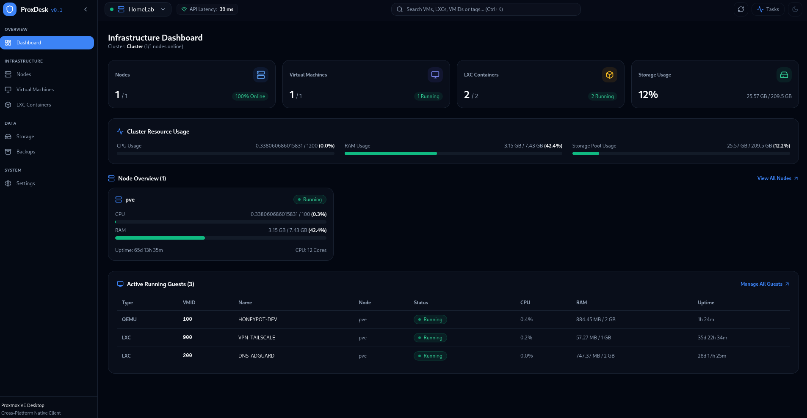
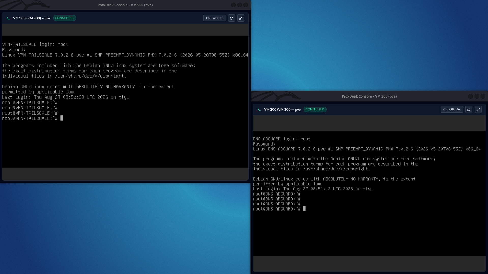
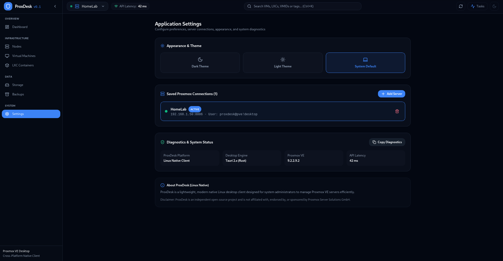
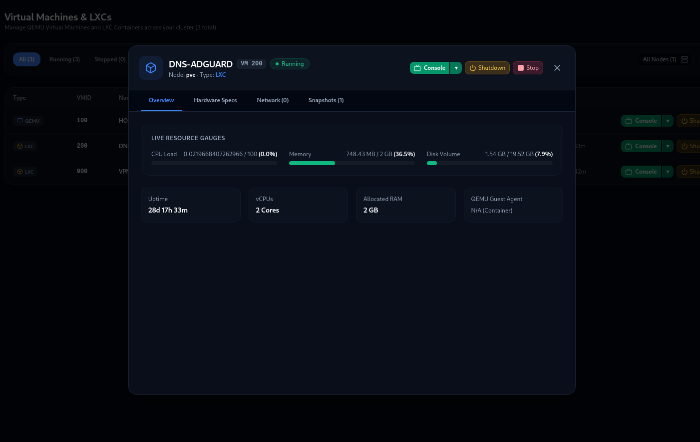

# ProxDesk – Proxmox VE Linux Native Desktop Client

**ProxDesk** is a modern, fast, lightweight native desktop client built strictly for **Linux** (X11 & Wayland) system administrators managing [Proxmox VE](https://www.proxmox.com/) clusters and standalone nodes. Powered by **Tauri 2.x**, **Rust**, **React**, **TypeScript**, and **Tailwind CSS**, ProxDesk delivers an instant desktop-native interface for daily sysadmin operations without heavy browser overhead.



---

## 🌟 Key Features

- ⚡ **Linux Native Performance**: Built with Tauri 2.x and Rust backend for Linux desktop environments.
- 🔐 **Linux Secret Service Integration**: Full API Token authentication with secrets saved in native Linux keyrings (`org.freedesktop.secrets` / GNOME Keyring) or protected local vault (`0600` chmod). Zero plaintext secret storage.
- 🛡️ **Custom TLS & Fingerprint Pinning**: Handles self-signed certificates with explicit SHA-256 fingerprint inspection and pinning. No blind disabling of TLS validation.
- 📺 **VMware-Style Embedded Console Window**: Live noVNC & xterm.js guest console embedded directly inside the ProxDesk application window with fullscreen support and single-click SSL trust.
  <br>
- 🌐 **Multi-Server Connections**: Save, test, edit, and switch between multiple Proxmox VE server profiles seamlessly.
  <br>
- 📊 **Real-time Infrastructure Dashboard**: Aggregate cluster stats, node hardware metrics, resource usage gauges, and active guest table.
- 🖥️ **QEMU VM & LXC Container Controls**: Filterable/searchable inventory, status badges (● Running, ○ Stopped, ◐ Paused), and power actions (Start, Shutdown, Reboot, Force Stop).
  <br>
- ⚙️ **UPID Task Engine**: Asynchronous task progress tracking (UPID status polling) with header status indicators and monospace task log viewer.
- 📸 **Snapshot Management**: View snapshot trees, create snapshots (with RAM state option), rollback, and delete.
- 💾 **Storage & Backup Inspector**: Storage pool usage bars, content types, and backup archive explorer.
- 🎨 **Modern Sysadmin UI**: Dark/Light mode theme system, responsive collapsible sidebar, keyboard shortcuts (`Ctrl+R`), and diagnostic telemetry export.

---

## 🛠️ Tech Stack

| Layer | Technology |
| :--- | :--- |
| **Target Platform** | **Linux Native** (Ubuntu, Debian, Fedora, Arch, Kali, Mint, RHEL) |
| **Desktop Framework** | [Tauri 2.x](https://tauri.app/) (GTK3 / WebKitGTK) |
| **Native Layer** | [Rust](https://www.rust-lang.org/) (`reqwest`, `tokio`, `keyring`, `sha2`, `serde`) |
| **Frontend Framework** | [React 19](https://react.dev/) + [TypeScript](https://www.typescriptlang.org/) + [Vite](https://vite.dev/) |
| **Styling** | [Tailwind CSS](https://tailwindcss.com/) + [Lucide Icons](https://lucide.dev/) |
| **State Management** | [TanStack Query](https://tanstack.com/query) + [Zustand](https://zustand-demo.pmnd.rs/) |

---

## 🚀 Installation

1. Go to the [Releases](https://github.com/cagriyildirimer/ProxDesk/releases) page.
2. Download the latest `.deb` package (e.g., `ProxDesk_0.1.0_amd64.deb`).
3. Install it using `dpkg` or your favorite GUI package manager:
   ```bash
   sudo dpkg -i ProxDesk_0.1.0_amd64.deb
   sudo apt-get install -f # to resolve any missing dependencies
   ```
4. Launch **ProxDesk** from your application menu.

---

## 🔑 Proxmox VE API Token Setup

ProxDesk uses Proxmox VE API Tokens instead of raw passwords to ensure maximum security. To connect ProxDesk to your Proxmox server, follow these steps:

### 1. Create a User and Role (Optional but Recommended)
For security, it is highly recommended to create a dedicated user/role instead of using the `root@pam` user.
1. Log in to your Proxmox web interface.
2. Go to **Datacenter -> Permissions -> Roles** and ensure you have an appropriate role (e.g., `PVEVMAdmin` for managing VMs/LXCs, or `Administrator` for full access).
3. Go to **Datacenter -> Permissions -> Users** and create a new user (e.g., `proxdesk@pve`).
4. Go to **Datacenter -> Permissions** and assign the role to your user on the `/` (root) path.

### 2. Generate an API Token
1. Go to **Datacenter -> Permissions -> API Tokens**.
2. Click **Add** and select the user you want to use (e.g., `root@pam` or your dedicated user).
3. Enter a Token ID (e.g., `desktop`).
4. Uncheck "Privilege Separation" if you want the token to inherit all permissions of the user.
5. Click **Add**.
6. **IMPORTANT:** Copy the generated `Secret` value immediately. Proxmox will only show it once!

### 3. Connect ProxDesk
1. Open ProxDesk and click **Add Connection**.
2. Fill in your Node/Cluster details.
3. For the API Token, enter it in the format expected by ProxDesk:
   - **Token ID**: Your generated Token ID (e.g., `root@pam!desktop` or `proxdesk@pve!desktop`)
   - **Token Secret**: The secret key you copied earlier.
4. Click **Test & Save**.

---

## 💻 Development & Building Instructions (Linux)

If you want to compile ProxDesk from source, follow these steps:

### System Dependencies
On Debian/Ubuntu/Kali:
```bash
sudo apt-get update
sudo apt-get install -y libwebkit2gtk-4.1-dev libgtk-3-dev libsecret-1-dev libssl-dev pkg-config build-essential
```

### Running Development Mode
```bash
cd /opt/ProxDesk
export RUSTUP_HOME=/home/cagri/.rustup CARGO_HOME=/home/cagri/.cargo PATH="/usr/share/nodejs/corepack/shims:/home/cagri/.cargo/bin:$PATH"

npx tauri dev
```

### Building Linux Packages (.deb / AppImage)
```bash
cd /opt/ProxDesk
export RUSTUP_HOME=/home/cagri/.rustup CARGO_HOME=/home/cagri/.cargo PATH="/usr/share/nodejs/corepack/shims:/home/cagri/.cargo/bin:$PATH"

npx tauri build
```
The generated Linux binaries will be saved in `/opt/ProxDesk/src-tauri/target/release/bundle/deb/` and `appimage/`.
